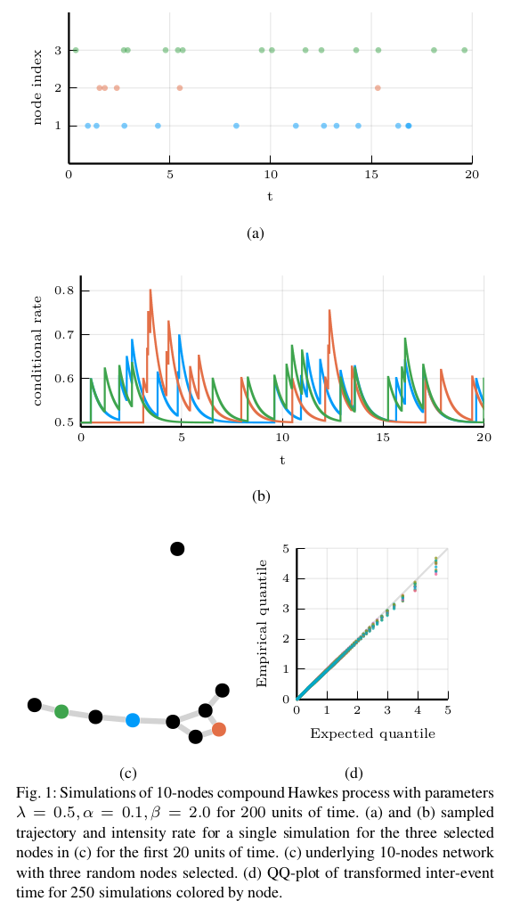

# Extending `JumpProcesses.jl` for fast point process simulation

**Point processes model the occurrence of a countable number of random points over some support. They are useful to describe phenomena including chemical reactions, stockmarket transactions and social interactions. In this talk, we show that JumpProcesses.jl is a fast, general purpose library for simulating point processes, and describe extensions to JumpProcesses.jl that significantly speed up the simulation of point processes with time-varying intensities.**

Jump and point processes share many similarities despite their somewhat independent developments. JumpProcesses.jl was first developed for simulating jump processes via stochastic simulation algorithms (SSAs) (including Doob’s method, Gillespie’s methods, and Kinetic Monte Carlo methods). Historically, jump processes have been developed in the context of dynamical systems with the objective of describing dynamics with discrete jumps. In contrast, the development of point processes has been more focused in describing the occurrence of random events. In this talk we bridge the gap between the treatment of point and jump process simulation. The algorithms previously included in JumpProcesses.jl can be mapped to three general methods developed in statistics for simulating evolutionary point processes. Our comparative exercise reveals that the library originally lacked an efficient algorithm for simulating processes with variable intensity rates. We therefore extended JumpProcesses.jl with a new simulation algorithm, Coevolve, that enables the rapid simulation of processes with locally-bounded variable intensity rates. It is now poosible to efficiently simulate any point process on the real-line with a non-negative, left-continuous, history-adapted and locally bounded intensity rate. This extension significantly improves the computational performance of JumpProcesses.jl when simulating such processes, enabling it to become one of the only readily available, fast, general purpose libraries for simulating evolutionary point processes.

